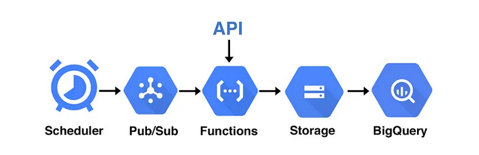
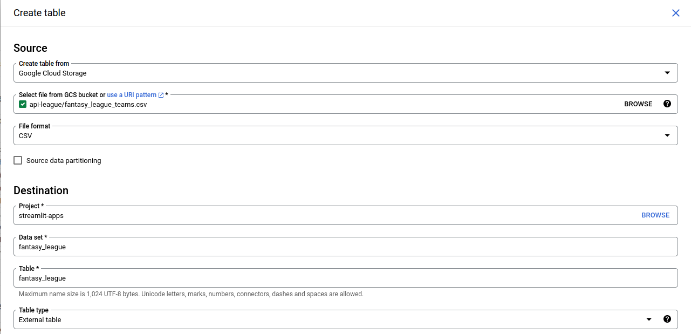

# Streamlit Fantasy Football League

The data is stored in Google Cloud Platform (GCP), and we use GCP's Cloud Functions for running the code that collects and processes the data. The processed data is then uploaded to BigQuery, from where it is fetched and displayed on the Streamlit dashboard.

## Loading API Data into Google BigQuery with Cloud Functions and Scheduler

Workflow and Google Cloud functions we’ll be using:

## Prerequisites

Google Cloud Project with neccessary IAM permissions.

## Workflow
API used for this project:
https://fantasy.premierleague.com/api/bootstrap-static/

`load_gcp.py` script is used within Cloud Function.

Script simply imports the **`teams`** endpoint data from our API location into a dataframe. As we want to store this data in Google Cloud Storage so it can be streamed into BigQuery, we’ll also need to use the Google Cloud Storage Python library. 

### Cloud Function
Now let’s create the Cloud Function that we’ll use to run this code. Navigate to the [Cloud Functions](https://console.cloud.google.com/functions) and click Create Function.

1. Add function name and choose region
2. Add Pub/Sub as Trigger & create new Topic
3. Click Next
4. Choose Inline Editor and copy `load_gcp.py` script into `main.py`, update project and bucket name
5. Add requirement.txt
6. Test function and Deploy

### Scheduling Updates

Navigate to [Cloud Scheduler](https://console.cloud.google.com/cloudscheduler) and select Create Job.

> [!NOTE]
> Cloud Scheduler uses unix-cron format

Set the Target to Pub/Sub , and the Topic to the one that you created earlier with the Cloud Function — this is how we’re going to trigger the function. 

Pub/Sub (publish/subscribe) is a secure service that allows communication between our Google Cloud platforms — our scheduled job will publish a “message” to our Pub/Sub topic. Our function will be listening out for this, and will run when the message is received.

### Uploading to BigQuery

1. Navigate to BigQuery, select your Project and hit the “Create Dataset” button 
2. Go to Create Table
3. Select “External table” from the Table type dropdown — this allows BigQuery to “stream” the data from Storage in real time, rather than making a static copy.

**Done!**

## Dashboard

Creating a Fantasy Football League dashboard using Streamlit. Streamlit is an open-source Python library that makes it easy to create custom web apps for machine learning and data science.

> Run app :
    
    poetry run streamlit run app.py

  You can now view Streamlit app in your browser on : **http://localhost:8501**